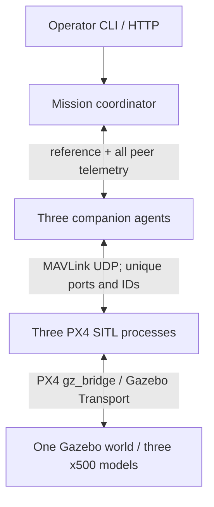

# Architecture and coordination methodology

## Process topology



Each companion container represents the software running on one Raspberry Pi
5. There are no PX4-to-PX4 telemetry links. Instead, agent i publishes its
estimated GPS position, velocity magnitude, mode, arming/landed state and data
ages to the coordinator. The coordinator distributes the full three-vehicle
snapshot to every agent. Each agent uses those peer states in its own bounded
formation correction. This is centralized mission planning with distributed
per-vehicle correction, not a leaderless consensus or leader/follower system.

PX4's `gz_bridge` runs inside each PX4 process and exchanges simulator sensor
and actuator data with Gazebo Transport. This link is not MAVLink and does not
use Gazebo Classic's TCP 4560 routing. MAVLink is the companion-to-PX4 link.

## Network routing

All five services share the simulator container's network namespace using
`network_mode: service:sim`. They retain separate processes and filesystems.
The result is private loopback routing without host networking or broadcasts.

| Vehicle | PX4 instance | MAV_SYS_ID | Gazebo model | PX4 local offboard UDP | Companion listens on UDP | Agent peer UDP |
|---|---:|---:|---|---:|---:|---:|
| 1 | 0 | 1 | `x500_0` | 14580 | 14540 | 16001 |
| 2 | 1 | 2 | `x500_1` | 14581 | 14541 | 16002 |
| 3 | 2 | 3 | `x500_2` | 14582 | 14542 | 16003 |

PX4 sends offboard telemetry to the corresponding localhost companion port.
Pymavlink's `udpin` endpoint learns the PX4 sender address and replies to its
local UDP port. Each companion uses MAVLink source system 241/242/243, component
191. It accepts flight-controller messages only from its expected system ID
and autopilot component 1; every flight command targets that same pair.

The coordinator binds UDP 16000. Agent i sends from 16000+i and accepts plans
only from 127.0.0.1:16000. Packets carry an increasing sequence number and a
host-monotonic send timestamp. Old, duplicate or expired plan packets are
discarded. State is not automatically reconciled after a process restart.

HTTP listens on 8080 inside this namespace, published only as host
127.0.0.1:8080. It is a simulation control interface, not an authenticated
multi-user service. PX4's default GCS links remain internal; no QGroundControl
connection is needed and no MAVLink port is published to the host.

## Frames and altitude

There is one configured geographic reference `(lat0, lon0, ground_AMSL)` for
the complete world. The controller uses local north/east/up (NEU) metres only
for formation geometry and interpolation. It does not mix the three EKF local
origins. All offboard targets sent to PX4 are GPS global coordinates.

For the small default operating radius:

```
north = R * radians(lat - lat0)
east  = R * cos(radians(lat0)) * radians(lon - lon0)
up    = estimated_AMSL - ground_AMSL
R     = 6378137 metres
```

This is a local tangent approximation using an Earth radius, not a global
geodesic/ellipsoidal navigation library. At the default roughly 30 m route it
is appropriate for the configured metre-scale tolerances; the implementation
limits the operating radius. For large areas, use a consistent geodetic
projection or GeographicLib and revalidate the world/controller mapping.

Gazebo uses ENU with heading zero. Spawn poses are therefore
`x=east, y=north, z=up`, not `x=north`. The generated markers use the same
conversion. MAVLink `SET_POSITION_TARGET_GLOBAL_INT` carries:

| Field | Value |
|---|---|
| `coordinate_frame` | `MAV_FRAME_GLOBAL` (0) |
| `lat_int`, `lon_int` | GPS degrees multiplied by 1e7 |
| `alt` | AMSL metres, `origin.amsl + target.up` |
| `yaw` | 0 radians, north |
| `type_mask` | 2552: ignore velocity, acceleration and yaw rate |
| `time_boot_ms` | Latest observed PX4 boot timestamp |
| rate | 20 Hz default |

PX4 supports the global position message in offboard mode and converts it
through its own estimator reference. This avoids treating a latitude as a
local X coordinate or sending relative-home altitude as AMSL.

## Formation controller

The triangle has side length s=12 m and fixed orientation. Its NEU offsets are:

```
r1 = ( s/sqrt(3),        0, 0)
r2 = (-s/(2*sqrt(3)), -s/2, 0)
r3 = (-s/(2*sqrt(3)),  s/2, 0)
```

The shared reference centroid is c(t). Nominal position is `q_i = c(t)+r_i`.
For measured peer positions p_i, companion i computes:

```
e_i = (1/2) * sum over j != i [ (p_j - p_i) - (r_j - r_i) ]
delta_i = vector_norm_limit(0.25 * e_i, 0.6 metres)
target_i = q_i + delta_i
```

This adds a small correction to the independent PX4 position servos. There is
no integral term. A lagging vehicle gets a correction toward the group while
the others get a correction toward it. The nominal shared centroid prevents
the triangle from drifting freely. Correction is disabled before takeoff and
during the final coordinated descent to preserve exact pad reference targets.

All three agents receive the same centroid and peer snapshot. The coordinator
advances c(t) at bounded horizontal/vertical speeds. It freezes centroid
progression if any edge error exceeds 1.5 m or nominal tracking error exceeds
2.5 m. If the errors recover, progression resumes within the original phase
deadline. Above 4 m edge error or below 5 m pair separation, it latches abort.

These values are acceptance/control settings, not proven performance claims.
The nominal triangle is exactly equilateral; actual flight has tracking error.
The algorithm is not a collision-avoidance proof. It has no obstacle planner,
no aerodynamic interaction model and no robust guarantee under GPS bias,
packet loss, wind, saturation or estimator faults.

## Mission state machine and barriers

| State | Commands/behavior | Release condition |
|---|---|---|
| WAIT | Telemetry only, motors disarmed | Explicit `start` plus all peers healthy, on ground, correct homes |
| PRESTREAM | Stream stationary measured-ground targets | 2.5 s of streaming |
| OFFBOARD | Retry PX4 mode command | All three fresh heartbeats confirm OFFBOARD |
| ARM | Retry normal arming; no force-arm | All three fresh heartbeats confirm armed and OFFBOARD |
| TAKEOFF | Common ascent reference begins after 0.75 s release lead | All reach 8 m reference within tolerance and settle |
| AUTO | Follow GPS centroid waypoints sequentially | Each vehicle near its own vertex with speed below 0.4 m/s for 2 s |
| MANUAL | Follow injected centroid waypoint | Reach waypoint, then HOLD |
| HOLD | Freeze centroid, keep formation targets | Operator resume/waypoint/land, or hold timeout |
| APPROACH | Move to designated landing centroid | All settle at assigned target vertices |
| DESCEND | Lower common reference to 2 m AGL | All settle over pads at staging height |
| LAND | Stop offboard stream and request AUTO.LAND at common epoch | All report fresh landed and disarmed states |
| ABORT | Stop trajectory and request individual land immediately | All landed/disarmed leads to FAILED, never DONE |
| DONE/FAILED | Terminal, no automatic rearm | Recreate whole simulation for next run |

Mode and arm COMMAND_ACK messages are logged. They are not treated as proof
that the requested state was reached; barriers inspect the heartbeat/landed
telemetry. Denials or missing ACKs eventually surface as a phase deadline and
abort. Retry interval is 1 s. Preflight barriers have a 12 s phase deadline.
Normal PX4 preflight checks remain active.

Landing commands use unspecified GPS fields (NaN) to land at the current
location. Before a normal landing, every vehicle has already been placed over
its distinct designated pad. The logger writes those NaN command fields as
JSON null; the MAVLink packet retains the required NaN values.

## Synchronization semantics

All containers run on one kernel and share `time.monotonic()`. After the
all-armed barrier, the mission establishes a future takeoff release and freezes
the centroid until that epoch. For final landing, agents continue the staging
setpoint until a common future epoch, then issue native land commands. Datagram
delivery, Python scheduling, heartbeat cadence and PX4 response introduce skew.
This coordinates triggers; it does not promise identical liftoff or touchdown.

The default 20 Hz loop has a 50 ms nominal period, not a guaranteed real-time
deadline. Measure command skew and physical/estimated transition skew from
the resulting logs. Normal formation is maintained through approach and
descent; after native AUTO.LAND begins, each PX4 completes its own landing.

## Fault handling

* A coordinator lease expires after 0.75 s without a fresh plan.
* Global-position freshness is checked independently from heartbeat and packet
  freshness. Resending an old position does not make it fresh.
* Agents check peer data in the shared snapshot and their own local telemetry.
* A local watchdog fault latches landing and prevents return to OFFBOARD or ARM,
  even if plans resume. Other agents see that fault and the coordinator aborts.
* If an agent crashes, PX4 loses its offboard stream. `COM_OF_LOSS_T=0.7` and
  `COM_OBL_RC_ACT=4` configure PX4's own offboard-loss landing response.
* If a control loop cannot deliver its land command, stopping the offboard
  setpoint stream still invokes the configured PX4 failsafe.
* A failed/missing vehicle never counts as landed. LAND/ABORT keep waiting and
  reporting states; they do not manufacture success after a timer expires.

The all-vehicle response cannot command a failed/disconnected FC. Independent
PX4 failsafes remain the last line of response. If Gazebo or the entire computer
stops, this is a stopped simulation, not a demonstrated safe landing.

Watchdogs use wall/monotonic host time while PX4 uses simulation time. Keep
Gazebo near real time. Pausing Gazebo midflight or severely overloading the host
can invalidate timing assumptions and trigger aborts. This implementation is
not designed for arbitrary simulation speedup or slow motion.

## Porting the application to real Pi 5 companions

The current deployment is deliberately single-host SITL. A real multi-host
version needs the following engineered changes, not only a Docker image copy:

1. Replace fixed loopback MAVLink endpoints with serial or managed Ethernet
   endpoints, preserving unique target system IDs and bidirectional routing.
2. Replace host-monotonic cross-process timestamps with a measured synchronized
   clock plus offset/uncertainty handling, or an explicit per-agent clock-sync
   protocol. Do not compare monotonic timestamps from different Linux boots.
3. Replace the hardcoded peer endpoints with configured authenticated network
   identities and design a lease/rejoin protocol for radio loss and restarts.
4. Validate relative localization error and set spacing/tolerances from actual
   evidence. Independent ordinary GPS receivers can report a good triangle
   while the physical triangle differs due to biases.
5. Retain flight-controller local control and validated recovery modes. The
   SITL-only `COM_RC_IN_MODE=4` setting is not a proposed real-aircraft RC policy.
6. Validate the exact Pixhawk board, sensors, frame, power system and Pi runtime
   before any hardware flight trials. This project supplies no hardware flight
   authorization or hardware acceptance claim.
